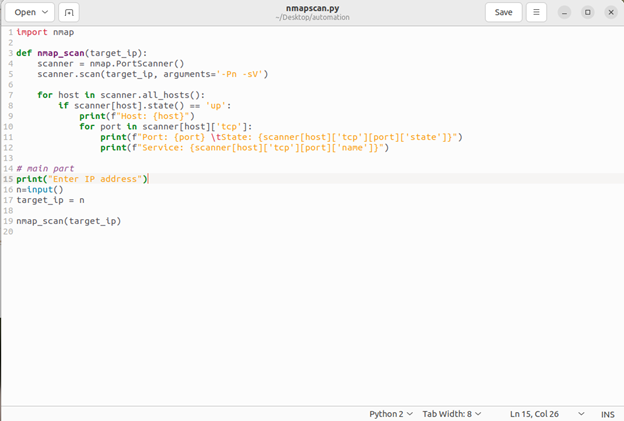
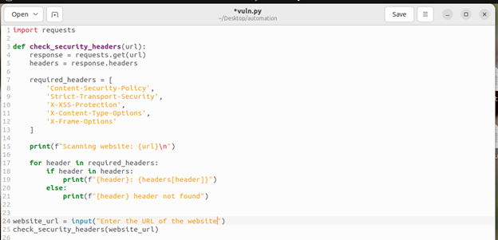
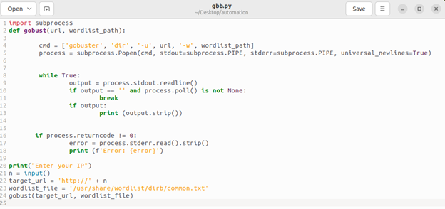
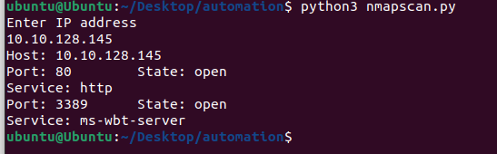
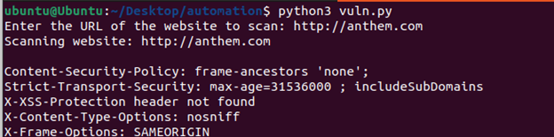
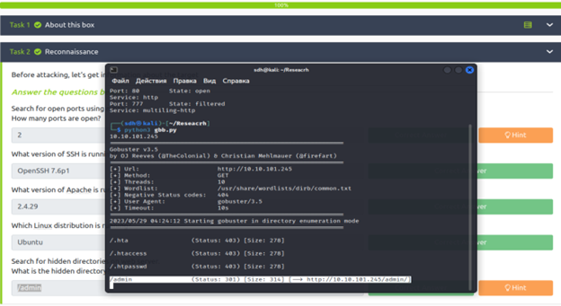

# Scripts
These scripts will help you quickly solve easy tasks like port scanning, detecting hidden files or folders. These scripts are useful for experienced people who don't want to tackle easy tasks as you can quickly get to the really hard tasks that require more advanced skills.
_____________
# Installation
* In the requirements you will find programs and libraries that are necessary for the full operation of the scripts.
* In directory svc you will find 3 python files, these are the scripts and you have to download them.
* After you have downloaded them, you need to run them in the terminal.
* How to run them: python3 file_name.py.
* After you run the file, you must specify the IP.
* That's all the instructions.
_____________
# Code Screenshots

_____________
# Live Examples

_____________
# License
GNU General Public License v3.0
